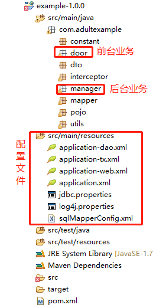

# 题库系统

#### 介绍
满足用户线上做题查看解析，及下载文档到本地的需求
满足管理者对试题，试卷等管理功能

#### 软件架构
使用SSM框架搭建项目，使用maven管理jar包

#### 使用说明

1. http://localhost:8080/login.jsp  后台首页     用户名：admin  密码：123

2. http://localhost:8080/door/tologin.action  前台登录页 用户名：admin 密码：123

3. http://localhost:8080/door/register.action 前台注册页

4. http://localhost:8080/door/toindex.action  前台首页

5. 数据库在com\adultexample\constant下

    
